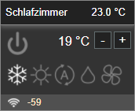

# ioBroker.vis-owl

**Tests:** 

## vis-owl adapter for ioBroker

Odd Widget Library

Aktuell gibt es nur ein Widget aber ein paar Ideen für weitere Widgets existieren bereits.

## Flexible Control

Widget zur Steuerung von Klimaanlagen, Luftreinigern, Heizungen, Motoren usw.

Ich nutze es um unsere Fußbodenheizung (3 Steuerungen), normalen Heizkörper (2 Stück), die Klimaanlage (3 Steuerungen) und die Luftreiniger (4 Steuerungen) in der VIS regeln und steuern zu können. Anfänglich über Gruppen realisiert, wurde schnell klar dass es bei Updates keinen Sinn mehr macht und ein Widget der wesentlich bessere Weg ist. Deswegen entstand das "Flexible Control". Sicher kann da noch wesentlich mehr damit gesteuert werden, da sind der Phantasie kaum Grenzen gesetzt.

Aktuell noch in einem sehr frühen aber (bei mir) stabilen Zustand. Über Feedback und gerne auch Änderungswünsche würde ich mich freuen.

## Dokumentation
Siehe Github Wiki

## Changelog
### 0.1.4 (2022-02-10)
* [Flexible Control comp] Bugfix Anzeige Werte im Infopanel
### 0.1.3 (2022-02-09)
* [Flexible Control comp] Info Panel hinzugefügt
### 0.1.2 (2022-02-07)
* [Flexible Control comp] Textfarbe für Ist-Wert in Eigenschaften übernommen (zur Nutzung von Bindings)
* [Flexible Control comp] Min & Max für Sollwert hinzugefügt
### 0.1.1 (2022-02-06)
* [Flexible Control comp] HTML & CSS Optimierungen
### 0.1.0 (2022-02-03)
* [Flexible Control comp] Erste öffentliche Beta
<!--
    Placeholder for the next version (at the beginning of the line):
    ###- **WORK IN PROGRESS**
-->-
### 0.1.5 (2022-02-10)
* Flexible Control extended
* Plug / Light Table (Tabelle für Steckdosen / Lichter)
* (Buchi) Code Verbesserungen / Optimierungen
### 0.1.6 (2022-02-10)

## License
MIT License

Copyright (c) 2022 Buchi <temp1@act4you.de>

Permission is hereby granted, free of charge, to any person obtaining a copy
of this software and associated documentation files (the "Software"), to deal
in the Software without restriction, including without limitation the rights
to use, copy, modify, merge, publish, distribute, sublicense, and/or sell
copies of the Software, and to permit persons to whom the Software is
furnished to do so, subject to the following conditions:

The above copyright notice and this permission notice shall be included in all
copies or substantial portions of the Software.

THE SOFTWARE IS PROVIDED "AS IS", WITHOUT WARRANTY OF ANY KIND, EXPRESS OR
IMPLIED, INCLUDING BUT NOT LIMITED TO THE WARRANTIES OF MERCHANTABILITY,
FITNESS FOR A PARTICULAR PURPOSE AND NONINFRINGEMENT. IN NO EVENT SHALL THE
AUTHORS OR COPYRIGHT HOLDERS BE LIABLE FOR ANY CLAIM, DAMAGES OR OTHER
LIABILITY, WHETHER IN AN ACTION OF CONTRACT, TORT OR OTHERWISE, ARISING FROM,
OUT OF OR IN CONNECTION WITH THE SOFTWARE OR THE USE OR OTHER DEALINGS IN THE
SOFTWARE.
